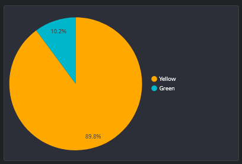

# Question 1
```SQL
SELECT count(1) FROM `evident-syntax-375104.dbt_week4.fact_trips`
WHERE DATE(pickup_datetime) BETWEEN '2019-01-01' AND '2020-12-31';
```
Answer 61541073. Choosen 61648442

# Question 2


Answer 89.8/10.2. Choosen 89.9/10.1


# Question 3
```SQL
SELECT COUNT(1) FROM `evident-syntax-375104.dbt_week4.stg_fhv_tripdata`
WHERE DATE(pickup_datetime) BETWEEN '2019-01-01' AND '2019-12-31';
```
Answer 43244693. Choosen  43244696

# Question 4
```SQL
SELECT count(*) FROM `evident-syntax-375104.dbt_week4.fact_fhv_trips`
WHERE DATE(pickup_datetime) BETWEEN '2019-01-01' AND '2019-12-31';
```
Answer 22998722. Choosen 22998722

# Question 5


Answer January
